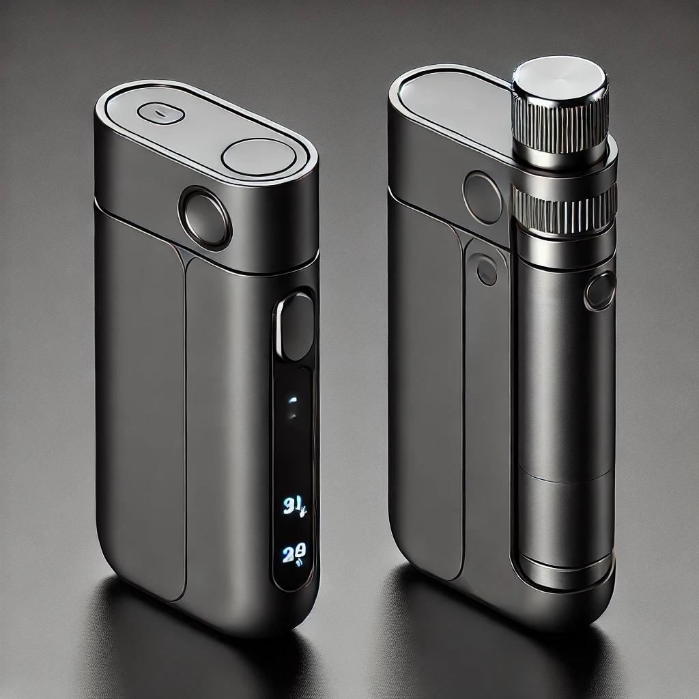

---

# Asthma App Core

## Overview

The **Asthma App** is a comprehensive mobile application designed to help users track their asthma management devices and monitor their vital signs. It enables asthma patients and caregivers to keep track of important data, helping ensure better asthma control and timely interventions. With this app, users can easily view their asthma-related metrics, such as device usage, medication adherence, and health vitals like heart rate, blood oxygen levels, and respiratory rates.

## Key Features

- **Asthma Device Tracking**: Seamlessly integrates with various asthma management devices (e.g., inhalers, nebulizers) to log usage, frequency, and effectiveness.
- **Vital Signs Monitoring**: Records and tracks vital signs such as heart rate, blood oxygen saturation (SpO2), respiratory rate, and more.
- **Health Data Insights**: Visualize trends over time for better asthma management, and receive notifications on abnormal readings.
- **Medication Reminders**: Set reminders for inhaler use, medication doses, and upcoming doctor visits.
- **Emergency Alerts**: Immediate notifications if critical vitals are detected outside safe ranges, aiding early detection of asthma attacks.
- **Reports & History**: Review past data, generate health reports, and share them with healthcare providers for informed decision-making.

## Usage

### Dashboard
The app provides an intuitive dashboard for easy access to key information, including:
- Current vital signs (heart rate, SpO2, respiratory rate).
- A snapshot of your device usage (e.g., inhaler logs, nebulizer data).
- Notifications for reminders, device health, or emergency alerts.

### Device Tracking
- **View Device Usage**: Track the date and time of each inhaler or nebulizer usage.
- **Set Reminders**: Create recurring reminders for device usage and medication intake.
- **Track Effectiveness**: Monitor whether your asthma device is working as expected.

### Vital Signs Tracking
- **Heart Rate**: View and track your heart rate over time.
- **Blood Oxygen Level (SpO2)**: Monitor your oxygen levels regularly for early signs of potential asthma flare-ups.
- **Respiratory Rate**: Keep track of your breathing rate to assess respiratory health.

### Reports & History
- View historical records of your vital signs and device usage.
- Generate detailed reports that can be shared with healthcare providers.

### Emergency Alerts
- The app will notify you if your vitals deviate from normal ranges. For example, if your SpO2 drops below a safe level, the app will send an immediate alert.
- In case of critical readings, the app may suggest actions or guide you to call a healthcare provider.

## Compatibility

- **Asthma Devices Supported**: Compatible with a wide range of asthma devices, including inhalers, nebulizers, and pulse oximeters.
- **Health Monitoring Devices**: Syncs with wearables and fitness trackers (e.g., Fitbit, Apple Watch) for continuous monitoring of heart rate, SpO2, and respiratory rate.

## Privacy & Security

We take your privacy seriously. All data is encrypted and stored securely. We comply with applicable health data protection laws (such as HIPAA) to ensure that your information remains private and secure. You can view and manage your data preferences through the app’s settings.

## Device Architecture

### Basic Components of the Device

#### 1. **Sensors:**

- **Oxygen Saturation Sensor (Pulse Oximeter Sensor):**
  - Example: MAX30102 or MAX30100.
  - Used to measure the blood oxygen saturation and heart rate.

- **Pressure/Flow Sensor for Nebulizer:**
  - Example: MPX5700AP, used to measure the pressure inside the nebulizer or monitor the airflow.

#### 2. **Microcontroller:**
- Choose a small and efficient unit to process data and send it to the server:
  - **ESP32**: Supports both Wi-Fi and Bluetooth connections.

#### 3. **Internet Connectivity:**
- **SIM Module for Cellular Connection (4G/LTE):**
  - Example: SIM800L or SIM7600G.

#### 4. **Display:**
- A small screen to display the measurements locally on the device.
  - Example: **OLED Display** using the I2C protocol.

#### 5. **Battery and Power Source:**
- **Li-ion 3.7V Battery**: With a charging module like **TP4056** to provide portable power for the device.
- **Voltage Regulator**: Such as **AMS1117** to regulate the voltage for the components.

#### 6. **Control Software:**
- **Firmware**: Written in languages like Arduino IDE or MicroPython to control the sensors and manage server communication.
- **API Interface**: For uploading data to the server using HTTP/HTTPS or MQTT protocols.

---

## Server Architecture:

### 1. **Device Sends Data to Server via Internet:**
- Use **REST API** or **MQTT Broker** to send data from the device to the server.

### 2. **Database:**
- Store health data in a database like **MySQL** or **MongoDB**.

### 3. **User Interface:**
- Develop a dashboard to display real-time health data using technologies like **React.js** or **Angular**.

---

## Component Table:

| Component                 | Type/Model      | Description                                             |
|---------------------------|-----------------|---------------------------------------------------------|
| Oxygen Sensor             | MAX30102        | Used to measure oxygen saturation and heart rate.       |
| Pressure Sensor for Nebulizer | MPX5700AP     | Monitors airflow or pressure in the nebulizer.          |
| Microcontroller            | ESP32           | Processes data and sends it via Wi-Fi.                 |
| Cellular Connectivity Module (Optional) | SIM800L  | Provides internet connectivity via cellular network.   |
| Display (Optional)        | OLED Display 0.96” | Displays measurements locally.                          |
| Battery                   | Li-ion 3.7V     | Provides portable power.                               |
| Battery Charger           | TP4056          | Safely charges the battery.                            |
| Voltage Regulator         | AMS1117         | Regulates voltage for the components.                  |

---

## Conclusion

The **Asthma App** is designed to empower asthma patients with the tools they need to effectively manage their condition. By seamlessly tracking device usage and vital signs, the app offers a convenient way to stay on top of your asthma management, detect potential issues early, and make informed decisions about your health. 

Stay safe, and breathe easier with the **Asthma App**!

---
